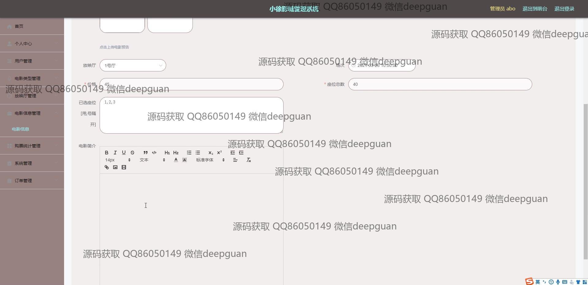
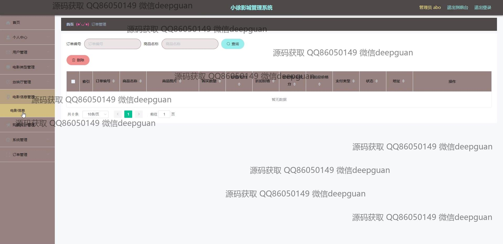

<h1 align="center">小徐影城管理系统</h1>

## 简介
小徐影城管理系统：角色分为管理员、用户；主要功能包括影城信息管理、电影排期安排、票务销售、用户管理、在线咨询和订单管理等，旨在提高影城运营效率和客户服务质量。    --计算机毕业设计源码；毕设源码；java毕业设计源码

## 联系方式

<h3 align="center">获取完整代码与数据库文件 + 微信：deepguan QQ: 86050149 QQ群: 783742310</h3>

<h3 align="center">可帮忙远程部署 包运行成功！提供远程部署、修改代码、设计文档指导、代码讲解等服务！</h3>

## 功能介绍（完整见运行截图）
管理员：提供影城的整体运营和管理功能。可以管理用户数据、电影信息、电影类型、放映厅、购票统计和系统设置。支持上传电影预告片和图片资料，方便更新影城信息。订单管理功能允许管理员查看订单状态、进行发货和处理退款。在线咨询模块支持与用户的实时互动，提升客户服务质量。

用户：在系统中可以查看电影的详细信息，包括票价、放映厅、场次等。支持选择座位并进行在线预订。个人中心提供个人信息管理、订单查询、账户余额查看和充值功能。用户可以提交对电影的评论，与其他用户进行互动。注册和登录界面为用户提供简单的身份验证和信息管理功能。

员工：负责日常的影城业务操作，如电影排期安排、放映厅管理和用户反馈处理。支持查看电影售票情况和进行数据统计分析，方便调整电影排期和优化影城运营策略。员工可以通过系统处理日常用户咨询，及时解决用户问题，提高影城服务效率。

影城管理系统：基于Spring Boot开发，提供直观简洁的用户界面和丰富的功能模块。支持影城管理的多方面需求，包括电影信息展示、订单管理、用户互动和数据分析。功能布局合理，提升用户体验，便于使用者快速找到所需的管理工具和信息，通过系统化的管理提高影城的运营效率。

## 运行截图

本代码来源于网络,仅供学习参考使用!

